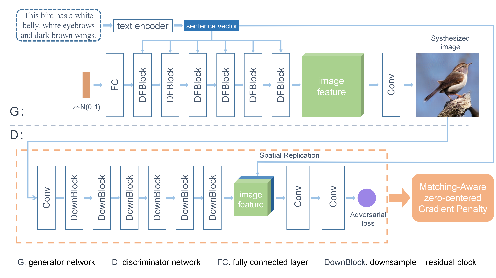
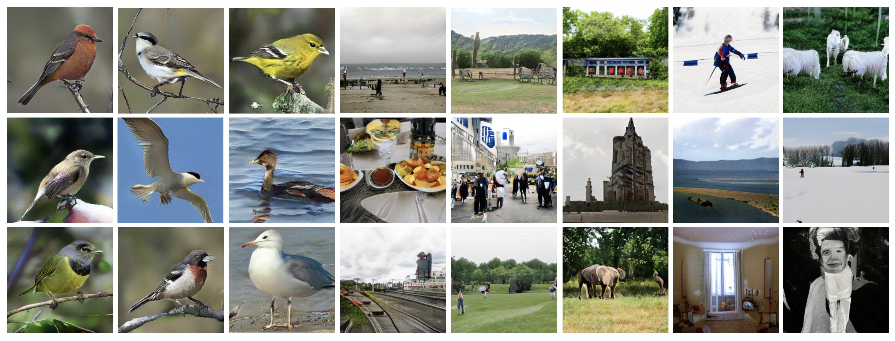

 
[](https://github.com/tobran/DF-GAN/blob/master/LICENSE.md)


[]((https://github.com/tobran/DF-GAN/graphs/commit-activity))

# DF-GAN: A Simple and Effective Baseline for Text-to-Image Synthesis (CVPR 2022 Oral)

Official Pytorch implementation for our paper [DF-GAN: A Simple and Effective Baseline for Text-to-Image Synthesis](https://arxiv.org/abs/2008.05865) by [Ming Tao](https://scholar.google.com/citations?user=5GlOlNUAAAAJ), [Hao Tang](https://scholar.google.com/citations?user=9zJkeEMAAAAJ&hl=en), [Fei Wu](https://scholar.google.com/citations?user=tgeCjhEAAAAJ&hl=en), [Xiao-Yuan Jing](https://scholar.google.com/citations?hl=en&user=2IInQAgAAAAJ), [Bing-Kun Bao](https://scholar.google.com/citations?user=lDppvmoAAAAJ&hl=en), [Changsheng Xu](https://scholar.google.com/citations?user=hI9NRDkAAAAJ). 



---
## News!
[CVPR2023]Our new simple and effective model GALIP ([paper link](https://arxiv.org/abs/2301.12959), [code link](https://github.com/tobran/GALIP)) achieves comparable results to Large Pretrained Diffusion Models! Furthermore, our GALIP is training-efficient which only requires 3% training data, 6% learnable parameters. **Our GALIP achieves ~120 x faster synthesis speed and can be inferred on CPU**. 

GALIP significantly lowers the hardware threshold for training and inference. We hope that more users can find the interesting of AIGC.

---
## Requirements
- python 3.8
- Pytorch 1.9
- At least 1x12GB NVIDIA GPU
## Installation

Clone this repo.
```
git clone https://github.com/tobran/DF-GAN
pip install -r requirements.txt
cd DF-GAN/code/
```

## Preparation
### Datasets
1. Download the preprocessed metadata for [birds](https://drive.google.com/file/d/1I6ybkR7L64K8hZOraEZDuHh0cCJw5OUj/view?usp=sharing) [coco](https://drive.google.com/file/d/15Fw-gErCEArOFykW3YTnLKpRcPgI_3AB/view?usp=sharing) and extract them to `data/`
2. Download the [birds](http://www.vision.caltech.edu/visipedia/CUB-200-2011.html) image data. Extract them to `data/birds/`
3. Download [coco2014](http://cocodataset.org/#download) dataset and extract the images to `data/coco/images/`


## Training
  ```
  cd DF-GAN/code/
  ```
### Train the DF-GAN model
  - For bird dataset: `bash scripts/train.sh ./cfg/bird.yml`
  - For coco dataset: `bash scripts/train.sh ./cfg/coco.yml`
### Resume training process
If your training process is interrupted unexpectedly, set **resume_epoch** and **resume_model_path** in train.sh to resume training.

### TensorBoard
Our code supports automate FID evaluation during training, the results are stored in TensorBoard files under ./logs. You can change the test interval by changing **test_interval** in the YAML file.
  - For bird dataset: `tensorboard --logdir=./code/logs/bird/train --port 8166`
  - For coco dataset: `tensorboard --logdir=./code/logs/coco/train --port 8177`

## Evaluation

### Download Pretrained Model
- [DF-GAN for bird](https://drive.google.com/file/d/1rzfcCvGwU8vLCrn5reWxmrAMms6WQGA6/view?usp=sharing). Download and save it to `./code/saved_models/bird/`
- [DF-GAN for coco](https://drive.google.com/file/d/1e_AwWxbClxipEnasfz_QrhmLlv2-Vpyq/view?usp=sharing). Download and save it to `./code/saved_models/coco/`

### Evaluate DF-GAN models
We synthesize about 3w images from the test descriptions and evaluate the FID between **synthesized images** and **test images** of each dataset.
  ```
  cd DF-GAN/code/
  ```
- For bird dataset: `bash scripts/calc_FID.sh ./cfg/bird.yml`
- For coco dataset: `bash scripts/calc_FID.sh ./cfg/coco.yml`
- We compute inception score for models trained on birds using [StackGAN-inception-model](https://github.com/hanzhanggit/StackGAN-inception-model). 

### Some tips
- Our evaluation codes do not save the synthesized images (about 3w images). If you want to save them, set **save_image: True** in the YAML file.
- Since we find that the IS can be overfitted heavily through Inception-V3 jointed training, we do not recommend the IS metric for text-to-image synthesis.

### Performance
The released model achieves better performance than the CVPR paper version.


| Model | CUB-FID↓ | COCO-FID↓ |NOP↓ |
| --- | --- | --- | --- |
| DF-GAN(paper) | 14.81 | 19.32 | 19M |
| DF-GAN(pretrained model) | **12.10** | **15.41** | **18M** |


## Sampling
  ```
  cd DF-GAN/code/
  ```
### Synthesize images from example captions
  - For bird dataset: `bash scripts/sample.sh ./cfg/bird.yml`
  - For coco dataset: `bash scripts/sample.sh ./cfg/coco.yml`
  
### Synthesize images from your text descriptions
  - Replace your text descriptions into the ./code/example_captions/dataset_name.txt
  - For bird dataset: `bash scripts/sample.sh ./cfg/bird.yml`
  - For coco dataset: `bash scripts/sample.sh ./cfg/coco.yml`

The synthesized images are saved at ./code/samples.



---
### Citing DF-GAN

If you find DF-GAN useful in your research, please consider citing our paper:

```
@inproceedings{tao2022df,
  title={DF-GAN: A Simple and Effective Baseline for Text-to-Image Synthesis},
  author={Tao, Ming and Tang, Hao and Wu, Fei and Jing, Xiao-Yuan and Bao, Bing-Kun and Xu, Changsheng},
  booktitle={Proceedings of the IEEE/CVF Conference on Computer Vision and Pattern Recognition},
  pages={16515--16525},
  year={2022}
}
```
The code is released for academic research use only. For commercial use, please contact [Ming Tao](mingtao2000@126.com).

**Reference**

- [StackGAN++: Realistic Image Synthesis with Stacked Generative Adversarial Networks](https://arxiv.org/abs/1710.10916) [[code]](https://github.com/hanzhanggit/StackGAN-v2)
- [AttnGAN: Fine-Grained Text to Image Generation with Attentional Generative Adversarial Networks](https://openaccess.thecvf.com/content_cvpr_2018/papers/Xu_AttnGAN_Fine-Grained_Text_CVPR_2018_paper.pdf) [[code]](https://github.com/taoxugit/AttnGAN)
- [DM-GAN: Realistic Image Synthesis with Stacked Generative Adversarial Networks](https://arxiv.org/abs/1904.01310) [[code]](https://github.com/MinfengZhu/DM-GAN)
